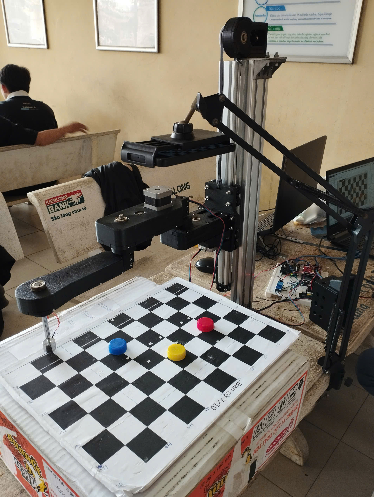
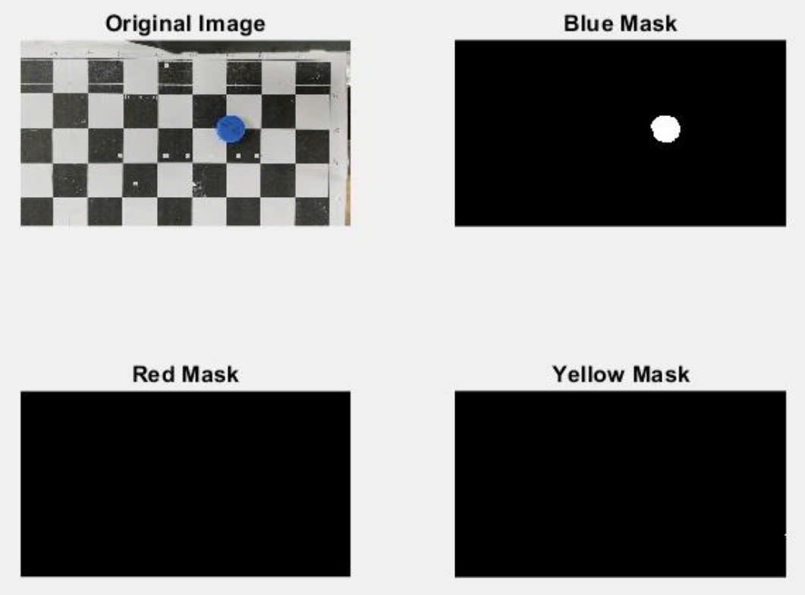
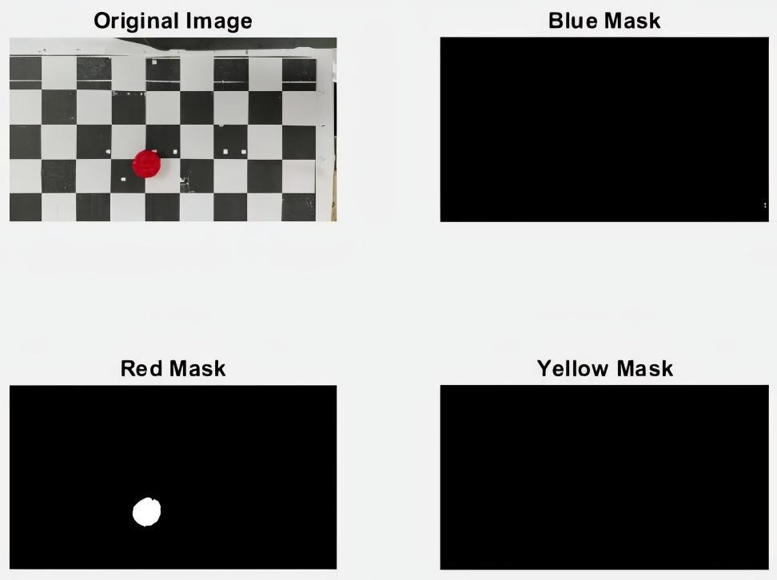
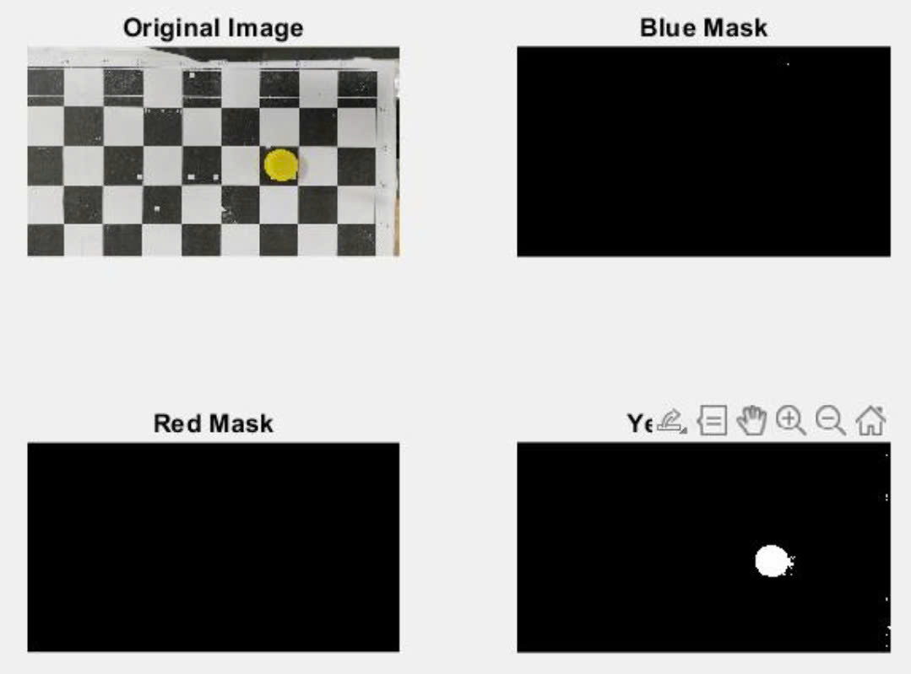
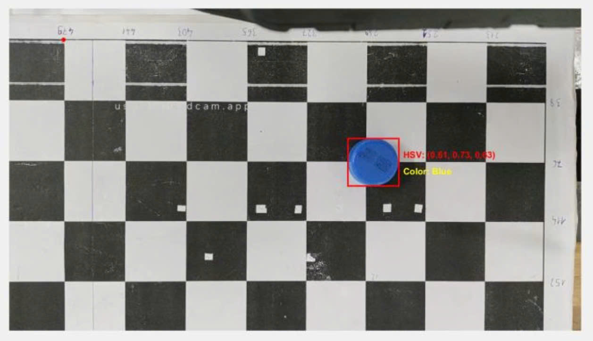
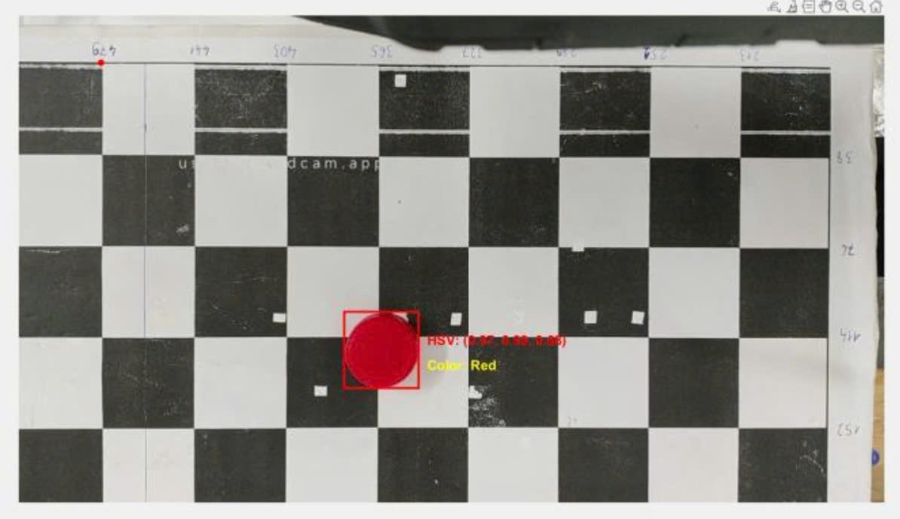
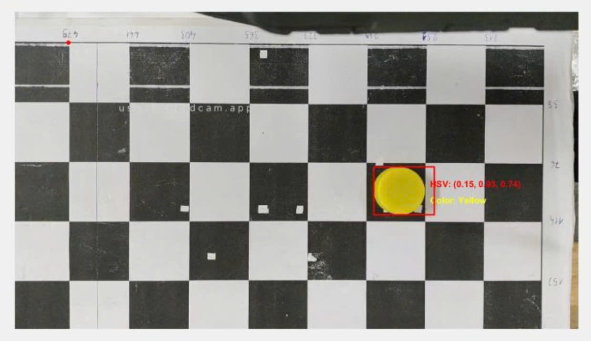
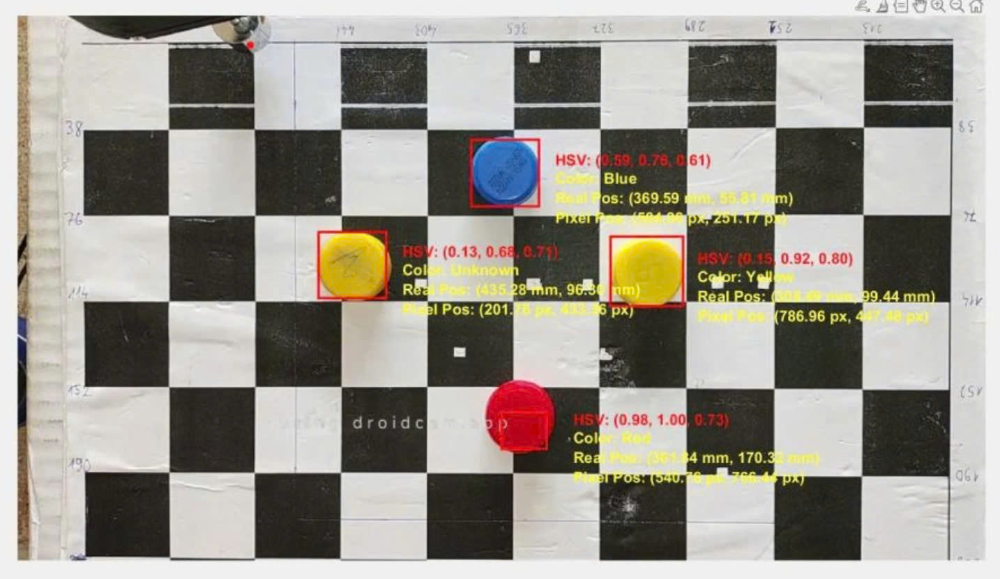

# 🤖 Application of Image Processing and 3-DOF SCARA Robotic Arm in Object Classification Based on Color

An academic project that combines **Computer Vision**, **Robotics**, and **Embedded Systems** to build a real-time sorting system. The system detects object color (Red, Yellow, Blue), computes the inverse kinematics of a 3-DOF SCARA robotic arm, and sorts the object using an electromagnetic gripper.

---

## 📌 Key Features

- 🎨 Detects and classifies colors using HSV thresholding in MATLAB  
- 📷 Captures live video using smartphone camera via DroidCam  
- 📐 Converts pixel coordinates to real-world positions using checkerboard calibration  
- ⚙️ Computes inverse kinematics and sends angles to Arduino  
- 🤖 SCARA robot performs pick-and-place actions with high precision  
- 🖥️ Controlled via MATLAB GUI (App Designer) with workspace visualization  
- ⚡ Gripper control + emergency reset handled via serial commands

---

## 🛠 Hardware Components

| Component              | Description                          |
|------------------------|--------------------------------------|
| SCARA Arm              | Custom-built 3-DOF robotic arm       |
| Controller             | Arduino UNO R3 + CNC Shield V3       |
| Stepper Motors         | 3× NEMA 17 + A4988 drivers           |
| Gripper                | 24V Electromagnetic                  |
| Camera                 | Smartphone camera via DroidCam       |
| Frame Design           | SolidWorks 3D Model (`FullRobot.STEP`)

---

## 💻 Software & Algorithms

| Module                 | Implementation / File                |
|------------------------|--------------------------------------|
| Image Processing       | `test_control/detect_pos.m`, `test_control/setup_cam.m` |
| Color Detection (HSV)  | `test_control/detect_pos.m`          |
| Position Calibration   | `test_control/cal_pos.m`, `test_control/TransMatrix.m` |
| Inverse Kinematics     | `test_control/IK.m`, `test_control/ik_2dof.m` |
| Forward Kinematics     | `test_control/fk_3dof.m`, `test_control/FK_control.m` |
| Control GUI            | `test_control/gui_test.mlapp`        |
| Workspace Simulation   | `test_control/Workspace.m`           |
| Gripper & Reset        | `test_control/Magnet.m`, `test_control/Reset_button.m` |
| Stepper Control (Arduino) | `control_stepper_4_step/control_stepper_4_step.ino` |

---

## 📂 Project Structure
```
.
├── control_stepper_4_step/
│  └── control_stepper_4_step.ino     # Arduino: stepper motors + serial protocol
├── test_control/
│  ├── gui_test.mlapp                 # MATLAB App Designer GUI
│  ├── detect_pos.m                   # HSV segmentation + centroid extraction
│  ├── setup_cam.m                    # Camera setup (DroidCam/webcam)
│  ├── cal_pos.m, TransMatrix.m       # Pixel -> mm calibration
│  ├── IK.m, ik_2dof.m                # Inverse kinematics
│  ├── fk_3dof.m, FK_control.m        # Forward kinematics + control
│  ├── Magnet.m, Reset_button.m       # Electromagnet + reset
│  ├── Workspace.m                    # Workspace visualization
│  └── control_test.m                 # End-to-end pick & place routine
├── docs/images/
│  ├── System_before_operation.jpg
│  ├── mask_blue.jpg
│  ├── mask_red_pic.jpg
│  ├── mask_yellow.jpg
│  ├── pos_blue_test.jpg
│  ├── pos_red_test.jpg
│  ├── pos_yellow_test.jpg
│  └── pos_all.jpg
├── FullRobot.STEP                    # CAD export (SolidWorks)
├── Video_demo.mp4
├── Robot Project Report (Group 5).pdf
└── README.md
```

---

## ⚙️ How It Works

1. 📸 Live image captured from camera via DroidCam  
2. 🎯 Object color segmented via HSV threshold (`detect_pos.m`)  
3. 📐 Pixel → mm conversion via checkerboard (`setup_cam.m`, `cal_pos.m`)  
4. 🧠 Inverse kinematics computed in MATLAB → joint angles  
5. 🔌 Angles sent to Arduino over serial → stepper motors activated  
6. 🧲 Electromagnet controlled for pick and release  
7. 🖱️ All steps are coordinated through a user-friendly GUI

---

## ▶ Demo
This short video demonstrates the real-time object classification and sorting system using a 3-DOF SCARA robotic arm, controlled via MATLAB and Arduino.

[](https://youtube.com/shorts/8Hgz4ZEQ1kY)

System before operation:

<p align="center">
  
</p>

---

## 🧪 Image Processing Results

### HSV Segmentation Masks

| Blue | Red | Yellow |
|---|---|---|
|  |  |  |

### Pixel-to-World Coordinate Output (Calibration + Target Position)

| Blue test | Red test | Yellow test |
|---|---|---|
|  |  |  |

All targets (combined view):

<p align="center">
  
</p>

---

## Unknown Case (Rejection Behavior)

In addition to testing **Red / Blue / Yellow**, we also tested an **Unknown** scenario to validate the system's ability to *reject* ambiguous inputs.

- **How we created Unknown**: we took a normal **yellow bottle cap** and drew several **black ink strokes** on its surface.
- **Observed behavior**:
  - Clean yellow cap -> classified as **Yellow**
  - Clean red cap -> classified as **Red**
  - Blue cap with small printed text (expiry code) -> still classified as **Blue**
  - Yellow cap with ink strokes -> classified as **Unknown**
- **Why this happens**: the added ink changes the local **HSV values** and can break/alter the segmented region (after morphological filtering). As a result, the detected region no longer satisfies the predefined HSV thresholds reliably, so labeling it as **Unknown** helps avoid a wrong color decision.

---

## 📊 Performance

| Metric                  | Result                          |
|--------------------------|---------------------------------|
| Known-color detection accuracy (Red/Blue/Yellow) | 100% (under controlled lighting, observed in demo) |
| Unknown rejection (yellow cap + ink strokes) | Classified as Unknown (observed) |
| Sorting success rate     | ~95%                            |
| Positioning error margin | ~2–4 mm                         |

Note: These results are reported under controlled lighting. Since the method is based on HSV thresholding, performance can degrade under severe lighting changes, heavy occlusion, or large surface markings.

---

## 🧠 Team Members

- **Lê Hoàng Khang** – 21151022 – HCMUTE  
- **Dương Hoàng Khôi** – 21151027 – HCMUTE

---

## 📄 License

This project is developed for academic purposes as part of the university robotics coursework.  
Not intended for commercial use.


